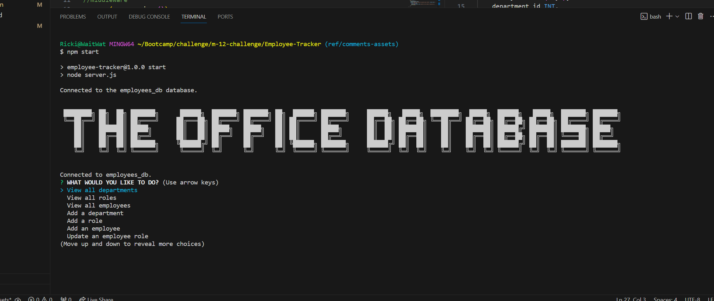

# Employee Tracker

   

## Table of Contents

- [Description](#description)
- [Installation](#installation)
- [Usage](#usage)
- [Credits](#credits)
- [Screenshot](#screenshot)
- [Walkthrough Video](#walkthrough-video)
- [Contribute](#contribute)
- [License](#license)
- [Questions](#questions)

## Description

This application allows the user to access a database to view and manage the departments, roles, and employees in a business. The database files were inspired by the show [The Office!](https://www.peacocktv.com/stream-tv/the-office)

## Acceptance Criteria

1. GIVEN a command-line application that accepts user input
2. WHEN I start the application
3. THEN I am presented with the following options: view all departments, view all roles, view all employees, add a   department, add a role, add an employee, and update an employee role
4. WHEN I choose to view all departments
5. THEN I am presented with a formatted table showing department names and department ids
6. WHEN I choose to view all roles
7. THEN I am presented with the job title, role id, the department that role belongs to, and the salary for that role
8. WHEN I choose to view all employees
9. THEN I am presented with a formatted table showing employee data, including employee ids, first names, last names, job titles, departments, salaries, and managers that the employees report to
10. WHEN I choose to add a department
11. THEN I am prompted to enter the name of the department and that department is added to the database
12. WHEN I choose to add a role
13. THEN I am prompted to enter the name, salary, and department for the role and that role is added to the database
14. WHEN I choose to add an employee
15. THEN I am prompted to enter the employee’s first name, last name, role, and manager, and that employee is added to the database
16. WHEN I choose to update an employee role
17. THEN I am prompted to select an employee to update and their new role and this information is updated in the database 

## Installation
 - [Visual Studio Code](https://code.visualstudio.com/)
 - [node.js](https://nodejs.org/en)
 - [inquirer  v.8.2.4](https://www.npmjs.com/package/inquirer/v/8.2.4)
 - [mysql2](https://www.npmjs.com/package/mysql2)
 - [dotenv](https://www.npmjs.com/package/dotenv)
 - [cfonts](https://www.npmjs.com/package/cfonts/v/3.2.0)
 - [nodemon](https://www.npmjs.com/package/nodemon)
 - [express](https://www.npmjs.com/package/express) - Future implementation
       

## Usage

1. From the command line type 'npm start'.
2. You will then be prompted with a list of options, use the arrow keys to navigate.
3. Hit 'Enter' on your selection and your database table or new prompts will appear.
4. If you would like to exit the application, select 'Exit' from the list of prompts and you will be taken back to the command line.

## Screenshot

## Walkthrough Video

[Click here](https://drive.google.com/file/d/1ugPf59JHwb14FwSc61juajd7U-MsCo3p/view)

## Credits

 1. This application is an assignment from module 12 from [The Ohio State University Coding Boot Camp](https://eng-bootcamps.osu.edu/).  The Acceptance Criteria above is from the challenge in module 12.
 2. The queryDepartments function, viewAllEmployees query, and decimal validation function were made with help from Bing AI.
 3. Application uses console.table for a cleaner table look.  It already comes with node.js.  For more information on console.table [click here](https://www.w3schools.com/jsref/met_console_table.asp).

## Future Development

Express has been added for possible future use.  I would also like to add better manager selection to the add employee option.

## Contribute 

If you would like to contribute please use the [Contributor Covenant](https://www.contributor-covenant.org/).

## License

   

***MIT License***

## Questions

 - Github Profile for [rickibobbii](https://github.com/rickibobbii)
